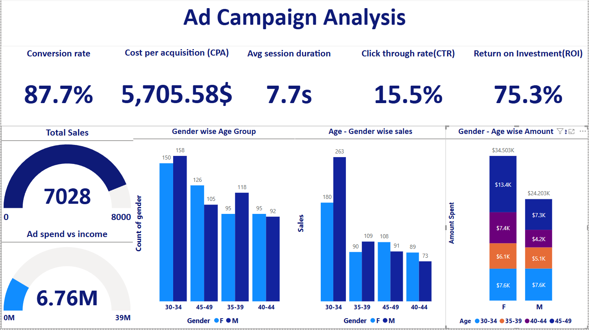

# 📈 Predicting Ad Campaign Conversion in Digital Marketing
🔍 Unlock the Power of Data to Optimize Your Marketing Campaigns!

## 📌 Overview
This project focuses on predicting ad campaign conversion rates using advanced machine learning techniques. By analyzing digital marketing data, we identify key factors that drive successful conversions and help marketers make data-driven decisions.

## Objective
The goal of this project is to develop a machine learning model that predicts customer conversion based on various demographic, behavioral, and campaign-related features. This system enables businesses to optimize marketing strategies by targeting potential customers more effectively.



## ✨ Features  
✅ **📊 Interactive Dashboard** – View insights & predictions in a sleek UI  
✅ **📁 CSV Upload & Manual Input** – Predict conversion from different data sources  
✅ **📉 Model Benchmarking** – Compare multiple ML models for best performance  
✅ **📈 Feature Importance Analysis** – Discover what impacts conversions the most  
✅ **🖥️ Flask Web App** – Fully functional backend for real-time predictions  
✅ **📑 Automated Reports** – Downloadable PDF reports with key insights  


## Dataset Description
The dataset consists of customer-related attributes collected from marketing campaigns. The features include:
- **CustomerID**: Unique identifier for each customer.
- **Age**: Age of the customer.
- **Gender**: Gender of the customer.
- **Income**: Annual income of the customer.
- **CampaignChannel**: The marketing channel used to reach the customer.
- **CampaignType**: Type of marketing campaign.
- **AdSpend**: Amount spent on advertisements.
- **ClickThroughRate**: Percentage of users who clicked on an ad.
- **ConversionRate**: Percentage of users who converted after interacting with an ad.
- **WebsiteVisits**: Number of visits to the website.
- **PagesPerVisit**: Average number of pages viewed per visit.
- **TimeOnSite**: Time spent on the website.
- **SocialShares**: Number of times content was shared on social media.
- **EmailOpens**: Number of marketing emails opened.
- **EmailClicks**: Number of links clicked in marketing emails.
- **PreviousPurchases**: Number of past purchases made by the customer.
- **LoyaltyPoints**: Reward points accumulated by the customer.
- **AdvertisingPlatform**: Platform used for advertising (Google, Facebook, etc.).
- **AdvertisingTool**: Specific tool used for running ads.
- **Conversion** (Target Variable): Whether the customer converted (1) or not (0).

## Methodology
1. **Data Exploration**: Initial analysis and visualization of dataset features.
2. **Data Preprocessing**: Handling missing values, encoding categorical features, and normalizing numerical features.
3. **Feature Engineering**: Creating new features, transformations, and encoding categorical variables.
4. **Model Selection**: Evaluating multiple machine learning models, including Stacking Classifier, XGBoost, CatBoost, and LightGBM.
5. **Hyperparameter Tuning**: Optimizing model parameters for better performance.
6. **Evaluation Metrics**: Using accuracy, precision, recall, and F1-score for model assessment.
7. **Deployment**: Developing a Flask web application with CSV upload & manual input options for real-time predictions.
8. **Visualization & Reports**: Generating interactive dashboards for data insights and predictions.


---

## 🛠️ Model Performance & Results  
We tested multiple models to determine the best performing one!  

### 📌 Model Benchmarking Table  


### 📌 Confusion Matrix  


### 📌 ROC Curve & Precision-Recall Curve  
 

---

## How to Run the Code
1. **Install dependencies**:
   ```bash
   pip install -r requirements.txt
   ```
2. **Run the Flask application**:
   ```bash
   python app.py
   ```
3. **Access the dashboard**:
   Open `http://127.0.0.1:5000/` in a web browser.

## Results Summary
The best-performing model was the **Stacking Classifier**, achieving:
- **Accuracy**: 94.17%
- **Precision (Weighted)**: 94.06%
- **Recall (Weighted)**: 94.17%
- **F1 Score (Weighted)**: 94.10%

## 📜 Report Paper
📄 Final Research Paper: Includes detailed analysis, methodology, and findings.
📑 Business Report: A concise summary of key takeaways for stakeholders.

## 📢 Contributing
Have ideas to improve this project? Feel free to fork the repo, open issues, and submit pull requests!


## How to Cite This Research
If you use this work in your research or project, please cite it as follows:
```
@article{CustomerConversion2025,
  title={Automated Customer Conversion Prediction},
  author={Khaldi Oussama},
  journal={Machine Learning for Marketing},
  year={2025},
  url={https://github.com/RobotTopDZ/Marketing_Conversion_Analysis}
}
```

